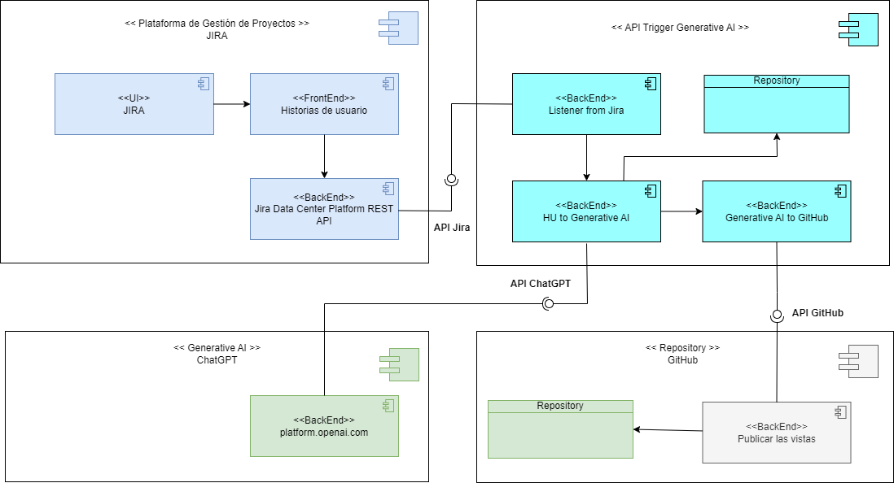

# Prototyping Automatization

This project is about using generative AI to prototype user interfaces and build with Python and ChatGPT 3.5.

The general idea is to have a requirements analyst generate tickets with clear descriptions of different user interfaces and pass those descriptions into ChatGPT to generate html/css/javascrip based interfaces automatically.

## Usage

- Install the  ```requirements.txt``` 
- Create an .env with the following variables
  
```
OPENAI_API_KEY = <REPLACE THIS>
JIRA_DOMAIN = <REPLACE THIS>
JIRA_API_TOKEN = <REPLACE THIS>
JIRA_USER_EMAIL = <REPLACE THIS>
```

- Replace the "tickets" values in main.py for your tickets.
- Run ```main.py```


## Architecture

The components architecture is as follows:



This implementation doesn't includes a listener or authomatically deploy to the repository.

## Prompt Engineering

The prompt template can be found in:

```
generative_ai\const.py
```

The prompt template looks like this:

```python
prompt = f"""
Act as a front-end web developer expert with deep knowledge of UI/UX best practices.

Based on the following user story delimited by triple backticks create three proposals with the code in html, css and javascript.

```{user_story}```

You should fill the <code_here> parts of the following output format:

{output_format}
"""

```

Where the user story is the user story description and the output format the expected generated output.


